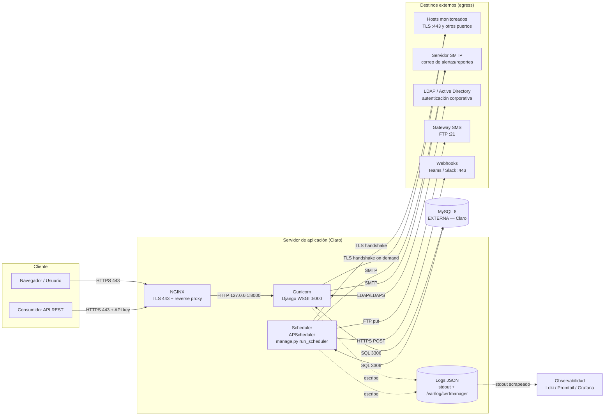

# CertManager (Aplicativo N1) — Diagrama de alto nivel del flujo de datos

**Aplicativo:** CertManager — monitoreo de certificados SSL/TLS.
**Documento:** Flujo de datos de alto nivel.
**Versión:** 1.0

---

## 1. Resumen

CertManager es una aplicación web (Django + Gunicorn) que:

1. **Monitorea** certificados SSL/TLS: se conecta periódicamente a cada host
   (TLS handshake), lee el certificado, calcula los días restantes y guarda el
   estado.
2. **Alerta** cuando un certificado está por vencer / vencido / con error, por
   **plataforma** (panel in-app), **correo (SMTP)**, **webhook** (Teams/Slack) y
   **SMS** (gateway FTP corporativo).
3. **Reporta** (PDF/Excel) y expone una **API REST** (autenticada por API key).

La base de datos (**MySQL 8**) es **externa**: la provee el equipo interno de
Claro. El aplicativo solo se instala a sí mismo y se conecta a esa BD.

---

## 2. Diagrama (Mermaid)



> Si tu visor no renderiza Mermaid, abajo está el mismo diagrama en ASCII.

---

## 3. Diagrama (ASCII)

```
                         ┌──────────────────────────────────────────────┐
   Navegador  ──HTTPS──▶ │  NGINX (TLS 443)  ──▶  Gunicorn (Django :8000)│
   Consumidor ──HTTPS──▶ │                                               │
   API + key             │  Scheduler (APScheduler · run_scheduler)      │
                         │  Logs JSON → stdout + /var/log/certmanager    │
                         └───────┬───────────────────────┬───────────────┘
                                 │ SQL 3306              │  egress
                                 ▼                       ▼
                         ┌───────────────┐   ┌───────────────────────────────┐
                         │  MySQL 8      │   │ • Hosts monitoreados (TLS 443) │
                         │  EXTERNA      │   │ • SMTP (correo)                │
                         │  (Claro)      │   │ • LDAP/AD (389/636)            │
                         └───────────────┘   │ • SMS gateway (FTP 21)         │
                                             │ • Webhooks Teams/Slack (443)   │
                                             └───────────────────────────────┘
   stdout (JSON) ─────────────────────────▶ Loki / Promtail / Grafana (obs.)
```

---

## 4. Flujos de datos (detalle)

| # | Flujo | Origen → Destino | Protocolo / Puerto | Disparo |
|---|-------|------------------|--------------------|---------|
| 1 | Acceso web | Usuario → NGINX → Gunicorn | HTTPS 443 → HTTP 8000 | Interactivo |
| 2 | API REST | Consumidor → NGINX → Gunicorn | HTTPS 443 (Api-Key) | Interactivo |
| 3 | Persistencia | App/Scheduler ↔ MySQL | TCP 3306 | Continuo |
| 4 | **Chequeo de certificados** | Scheduler → host monitoreado | TLS (443 u otro por cert) | Programado (cada 24h) + "Probar ahora" |
| 5 | Alertas por correo | App/Scheduler → SMTP | SMTP (587/465/25) | Al detectar riesgo |
| 6 | Alertas por webhook | App → endpoint Teams/Slack | HTTPS 443 | Al detectar riesgo |
| 7 | Alertas por SMS | Scheduler → gateway SMS | FTP 21 | Al detectar riesgo |
| 8 | Autenticación corporativa | App ↔ LDAP/AD | LDAP 389 / LDAPS 636 | Login (si LDAP activo) |
| 9 | Observabilidad | App → stdout → Loki | stdout (sin red) / HTTP push opcional | Continuo |

**Notas:**
- El flujo **4 (chequeo)** es la razón de ser del aplicativo: necesita salida a
  **cada host/puerto** que se quiera monitorear. Hay protección anti-SSRF
  (valida que el host resuelva a una IP pública; rechaza loopback/metadata/rangos
  internos por defecto — ver doc de necesidades si se requiere monitorear hosts
  internos).
- El aplicativo **no** persiste datos en servicios de terceros: todo vive en la
  **MySQL de Claro**. Solo emite logs (stdout/fichero) y notificaciones salientes.
- No hay procesamiento de pagos ni datos de tarjeta. Los datos sensibles son:
  credenciales SMTP/LDAP/FTP (cifradas en BD / variables de entorno), correos de
  destinatarios y metadatos de certificados.
