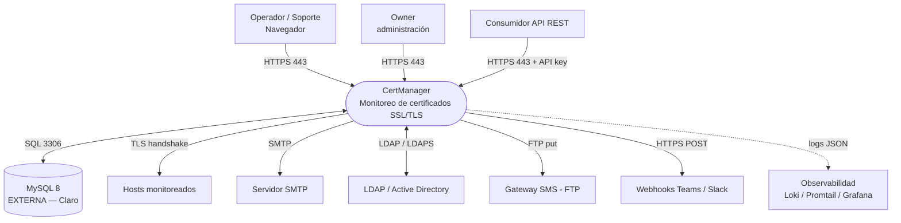
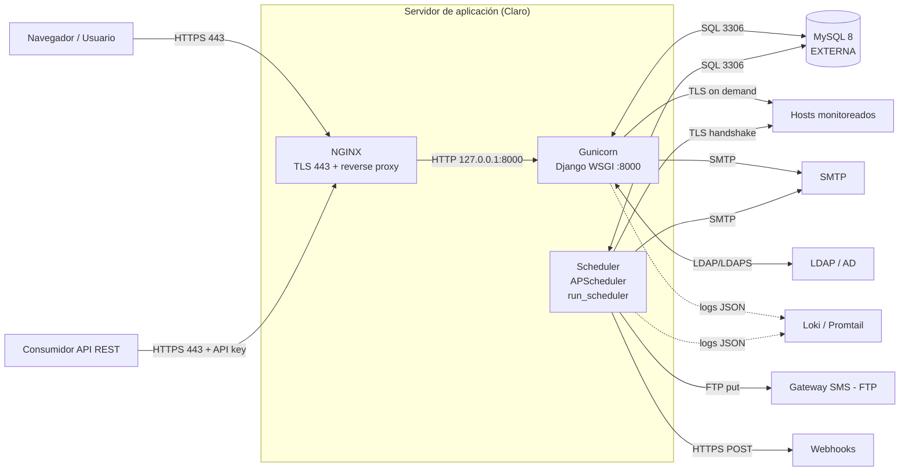

# Arquitectura — CertManager

## 0. Diagramas (contexto y flujo)

### Diagrama 0 — Contexto

CertManager visto como una única caja, con sus **actores** y los **sistemas
externos** con los que se integra. El nivel de detalle interno (NGINX, Gunicorn,
Scheduler) está en el Diagrama 1.



> Si tu visor no renderiza Mermaid, abajo está el mismo diagrama en ASCII.

```
        Operador/Soporte ─┐
        Owner ────────────┼──HTTPS 443──▶ ┌───────────────────────────┐
        Consumidor API ───┘  (+ API key)  │        CertManager        │
                                           │  Monitoreo SSL/TLS        │
                          ┌────────────────┤  (UI + API + scheduler)   │
                          │                └───────────┬───────────────┘
                  SQL 3306│ ▲                egress    │
                          ▼ │                          ▼
                   ┌────────────┐   ┌───────────────────────────────────┐
                   │  MySQL 8   │   │ • Hosts monitoreados (TLS)         │
                   │  EXTERNA   │   │ • SMTP (correo)                    │
                   │  (Claro)   │   │ • LDAP/AD (389/636)                │
                   └────────────┘   │ • Gateway SMS (FTP 21)            │
                                    │ • Webhooks Teams/Slack (443)       │
                                    │ • Observabilidad (logs JSON→Loki)  │
                                    └───────────────────────────────────┘
```

### Diagrama 1 — Flujo (nivel contenedor)

Las piezas internas del servidor de aplicación y el flujo de datos entre ellas.
El detalle por flujo (puerto, sentido, disparo) está en
[`01_diagrama_flujo_datos.md`](01_diagrama_flujo_datos.md).



> Versión ASCII del mismo flujo:

```
   Navegador  ──HTTPS──▶ ┌──────────────────────────────────────────────┐
   Consumidor ──HTTPS──▶ │  NGINX (TLS 443)  ──▶  Gunicorn (Django :8000)│
   API + key             │                                               │
                         │  Scheduler (APScheduler · run_scheduler)      │
                         └───────┬───────────────────────┬───────────────┘
                                 │ SQL 3306              │  egress
                                 ▼                       ▼
                         ┌───────────────┐   ┌───────────────────────────────┐
                         │  MySQL 8      │   │ • Hosts monitoreados (TLS)     │
                         │  EXTERNA      │   │ • SMTP · LDAP/AD               │
                         │  (Claro)      │   │ • SMS (FTP 21) · Webhooks (443)│
                         └───────────────┘   └───────────────────────────────┘
   stdout (JSON) ─────────────────────────▶ Loki / Promtail / Grafana
```

## 1. Visión general

Aplicación monolítica Django (UI server-rendered + API REST) con un planificador
en-proceso. Despliegue de 3 piezas: **NGINX** (TLS 443) → **Gunicorn** (app) +
**Scheduler** (tareas), contra una **MySQL externa**. Detalle del flujo de datos
en [`01_diagrama_flujo_datos.md`](01_diagrama_flujo_datos.md).

```
Navegador/API ──HTTPS 443──> NGINX ──HTTP 8000──> Gunicorn (Django)
                                                   Scheduler (APScheduler)
                                          │ SQL 3306        │ TLS / SMTP / LDAP / FTP / HTTPS
                                          ▼                 ▼
                                     MySQL 8           Hosts monitoreados, SMTP, LDAP,
                                     (externa)         gateway SMS, webhooks
```

## 2. Componentes (módulos)

| Módulo (`apps/`) | Responsabilidad |
|------------------|-----------------|
| `core` | Configuración global (OrganizationSettings), API keys, auditoría (AuditLog), middlewares (gate de admin, 2FA, expiración/timeout de sesión, log de request), backup. |
| `accounts` | Usuarios (login por email), Owner global, 2FA TOTP, lockout, validador de contraseña. |
| `teams` | Grupos (Team) + membresías (VIEWER/CONTRIBUTOR/ADMIN). |
| `certificates` | Certificados (dominio, puerto, ubicación, grupos), destinatarios, historial de chequeos. |
| `monitoring` | `SSLChecker`, orquestador `run_check`, scheduler, comandos (`check_certificates`, `data_update_certs_app`). |
| `alerts` | Alertas, entregas (AlertDelivery), webhooks, notificadores (correo/webhook/SMS). |
| `mailtemplates` | Plantillas de correo (builder por bloques). |
| `reports` | Reportes programados (CSV/PDF/Excel/correo). |
| `web` | Vistas Forge UI (dashboard, certs, grupos, usuarios, configuración, perfil). |
| `api` | Router DRF (`/api/certificates`, `/teams`, `/alerts`). |

## 3. Perfiles de configuración (`config/settings/`)

| Perfil | Uso | BD |
|--------|-----|----|
| `base` | común | — |
| `local` | desarrollo | SQLite |
| `standalone` | pruebas / VDI | SQLite (auto SECRET_KEY) |
| `prod` | **producción** | MySQL 8 (vars `DB_*`), HTTPS forzado |

## 4. Integraciones externas

| Integración | Cómo | Configurable en |
|-------------|------|-----------------|
| **Hosts monitoreados** | Handshake TLS (núcleo) | Por certificado |
| **SMTP** | Envío de alertas/reportes | Panel Correo |
| **LDAP/AD** | Verificación de credenciales (login transparente) | Panel LDAP |
| **SMS** | Depósito por FTP en gateway corporativo | Panel Integraciones |
| **Webhooks** | POST HTTPS (Teams/Slack) | Panel Integraciones |
| **Observabilidad** | Logs JSON a stdout → Loki (Promtail); opcional `obsforge` | Entorno |

## 5. Persistencia y estado

- **MySQL** (externa): única fuente de verdad (certs, usuarios, alertas, config, auditoría).
- **Estáticos**: servidos por la app (WhiteNoise), sin CDN.
- **Sin estado en memoria** compartido entre procesos (el scheduler usa un *lock* por archivo para ser singleton).

## 6. Seguridad (resumen)

HTTPS forzado (HSTS, cookies `Secure`), CSP, X-Frame DENY, anti-SSRF en chequeos
y webhooks, RBAC por grupo, API keys hasheadas, secretos por entorno. Detalle en
[`09_seguridad_y_cumplimiento.md`](09_seguridad_y_cumplimiento.md).

## 7. Decisiones de arquitectura (rationale)

- **Monolito + scheduler en-proceso:** simplicidad operativa; sin colas/servicios externos.
- **MySQL externa:** estándar corporativo; la app no gestiona la BD.
- **Server-rendered + HTMX:** sin SPA/build pesado; menos superficie de ataque (estáticos locales).
- **3 modos de despliegue** (Linux/Docker/K8s) sobre el mismo artefacto.
